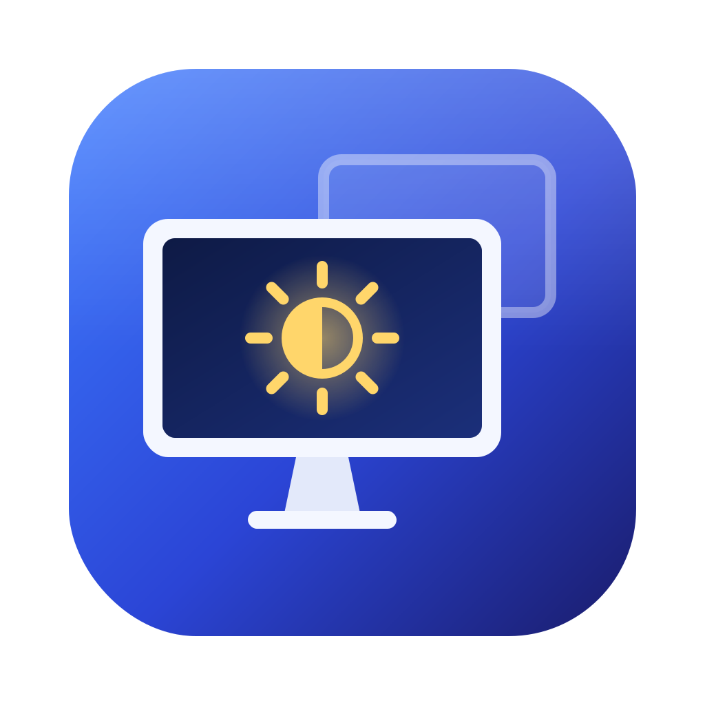

<p align="center"></p>

# DisplayPilot

Utilitaire de barre de menus pour gérer les écrans sur macOS (Swift/SwiftUI, Apple Silicon, arm64 uniquement).

## Fonctions

| Fonction | Implémentation |
|---|---|
| Luminosité / volume / muet des écrans externes | DDC/CI via `IOAVService` (API privée IOKit), adressage auto-détecté (direct ou via station) |
| Luminosité combinée DDC + logiciel | Haut du curseur = rétroéclairage, bas = gamma ; tout logiciel si le DDC ne passe pas (station) |
| Luminosité de l'écran intégré | `DisplayServices` (privé) |
| Touches clavier luminosité/volume + OSD | `CGEventTap`, HUD maison — ⇧⌥ + touche = pas fin |
| Résolutions, bascule HiDPI par résolution | `CGDisplayCopyAllDisplayModes` + `CGConfigureDisplayWithDisplayMode` |
| Création de modes HiDPI (toutes résolutions en un clic) | Override `/Library/Displays/Contents/Resources/Overrides` (invite admin ponctuelle) |
| Rotation 0/90/180/270° | MonitorPanel.framework (privé) |
| Écran principal, interrupteur marche/arrêt par écran | `CGConfigureDisplayOrigin`, `SLSConfigureDisplayEnabled` (portée session) |
| Presets automatiques par poste | Empreinte des écrans branchés → résolution, disposition, rotation, principal, luminosité, écrans coupés |

## Compilation

Prérequis : Mac Apple Silicon, Xcode 26+ ou Command Line Tools (macOS 15+ ; SDK macOS 27 testé).

```bash
bash scripts/create-signing-cert.sh    # une seule fois : certificat de signature local stable
bash scripts/build.sh --install        # build arm64 → /Applications + lancement
```

Sans certificat stable, la signature est ad-hoc et macOS redemande l'Accessibilité après chaque build.

## Déploiement Intune

```bash
bash scripts/make-pkg.sh           # → dist/DisplayPilot-<version>.pkg
bash scripts/make-mobileconfig.sh  # → dist/DisplayPilot.mobileconfig (PPPC + élément d'ouverture géré)
```

Le **pkg** installe `/Applications/DisplayPilot.app` et un LaunchAgent (`fr.darte.DisplayPilot.agent`) qui lance l'app à l'ouverture de session. L'app est démarrée tout de suite pour l'utilisateur connecté.

| Intune | Réglage |
|---|---|
| Type d'app | macOS › **macOS app (PKG)** (pkg non signé accepté) |
| Détection | Bundle ID `fr.darte.DisplayPilot`, version `CFBundleShortVersionString` |
| Profil | Appareils › Configuration › Créer › macOS › Modèles › **Personnalisé** → `DisplayPilot.mobileconfig`, canal **Appareil** |
| Ordre | Déployer le profil **avant** ou en même temps que l'app |

Le profil contient :
- **PPPC Accessibilité = Autoriser**, lié à l'exigence de code réelle de l'app (certificat de signature). Il reste valable pour toutes les versions signées avec le même certificat ; si le certificat change, régénérer le profil.
- **Éléments d'ouverture gérés** : l'agent ne peut pas être désactivé par l'utilisateur et n'affiche pas l'alerte « élément d'arrière-plan ajouté ».

Limites connues en déploiement :
- **HiDPI personnalisé** : l'écriture de l'override demande un compte administrateur. Sur les postes en utilisateur standard, déployer l'override par script Intune (fichier généré via « HiDPI… » sur un poste de référence).
- Les **API privées** (DDC, rotation, déconnexion) peuvent changer avec une mise à jour macOS : valider chaque version majeure sur un poste de test avant de l'étendre.

## Diagnostic DDC

```bash
/Applications/DisplayPilot.app/Contents/MacOS/DisplayPilot --ddc-debug            # inventaire + lecture
/Applications/DisplayPilot.app/Contents/MacOS/DisplayPilot --ddc-debug --set 30   # + écriture luminosité
/Applications/DisplayPilot.app/Contents/MacOS/DisplayPilot --ddc-debug --scan     # balayage des nœuds
```

## Comportements

- **Déconnexion logicielle** limitée à la session : une fermeture de session réactive tout. L'écran principal ne peut pas être coupé.
- **Touches luminosité** : écran sous le curseur par défaut (ou tous les écrans, dans Réglages).
- **Presets** : `~/Library/Application Support/DisplayPilot/presets.json`.
- **Une seule instance** à la fois (LaunchAgent géré + élément d'ouverture utilisateur ne se cumulent pas).

## Structure

```
Sources/DisplayPilot/
├── App.swift                 # MenuBarExtra, fenêtres HiDPI / Réglages, instance unique
├── Core/
│   ├── PrivateAPI.swift      # dlsym : DisplayServices, SkyLight, IOAVService
│   ├── DDC.swift             # découverte IORegistry, profils d'adressage, lecture/écriture I2C
│   ├── DDCDebug.swift        # --ddc-debug / --scan
│   ├── DisplayManager.swift  # état, modes, disposition, luminosité combinée, presets, touches
│   ├── MediaKeyTap.swift     # CGEventTap
│   ├── HiDPIOverride.swift   # génération/installation des overrides
│   ├── Rotation.swift        # MonitorPanel
│   └── Models.swift
└── UI/ MenuView, HiDPIView, SettingsView, HUD
packaging/                    # LaunchAgent + scripts pre/postinstall du pkg
scripts/                      # build, certificat, pkg, mobileconfig
Resources/                    # Info.plist, AppIcon.icns, Icon/ (SVG source + iconset)
```

## Licence

MIT — voir [LICENSE](LICENSE).
